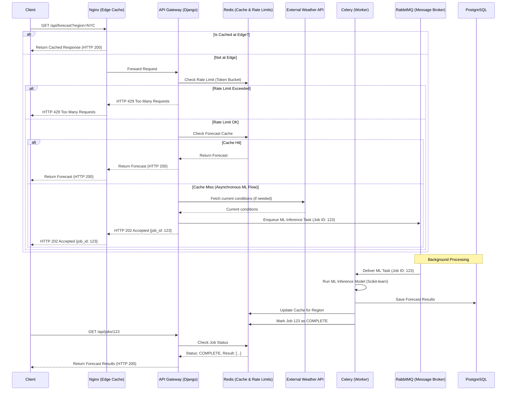

# AtmosSense Architecture

This document outlines the high-level system architecture and request flow for AtmosSense.

## Request Flow Diagram

## Component Roles
1. **Nginx**: Reverse proxy, SSL termination, and CDN-style Edge caching for static/public assets.
2. **Django & DRF (API Gateway)**: Handles authentication, rate limiting, cache checking, and enqueuing background tasks. Exposes Prometheus metrics and structured logs.
3. **Redis**: In-memory data store for the Token Bucket rate limiting counters, application-level caching, and job status tracking.
4. **RabbitMQ**: Highly reliable message broker that holds the queue of pending ML inference tasks.
5. **Celery Workers**: Scalable background workers that consume tasks from RabbitMQ, execute CPU-heavy ML inference (Scikit-learn) without blocking web requests, and gracefully shut down.
6. **PostgreSQL**: Persistent relational storage for historical weather data, user data, and long-term forecast archives.
7. **Prometheus / Grafana (Observability)**: Scrapes the `/metrics` endpoint to monitor API latency, HTTP status codes, and Celery queue depth.
